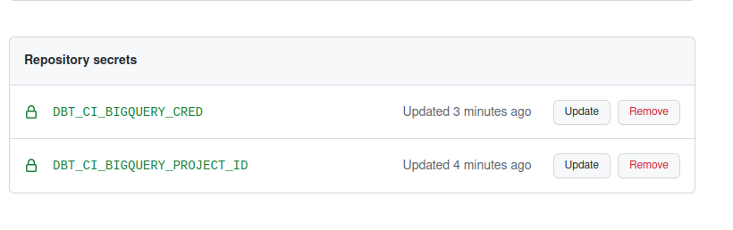
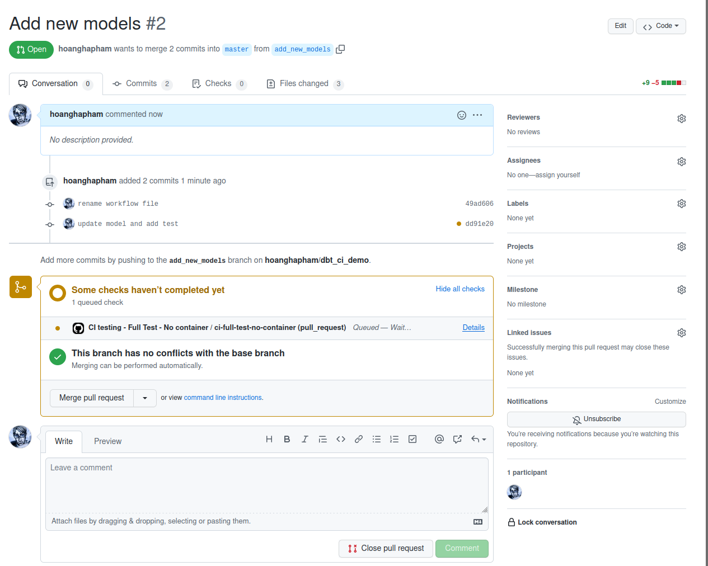
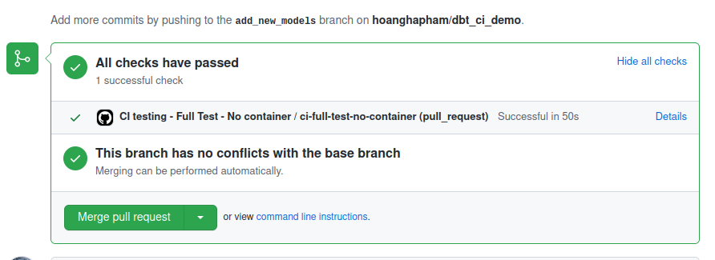
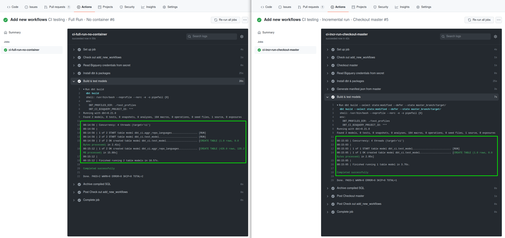
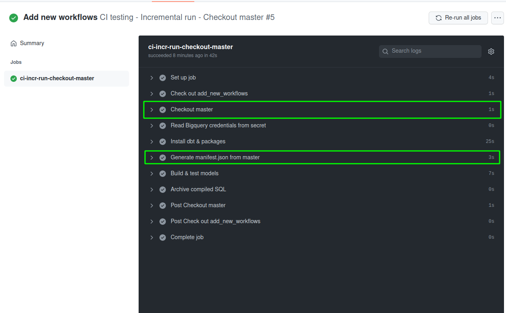
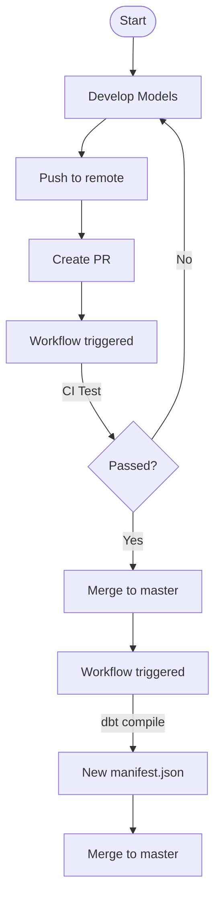

# dbt CI with GitHub Action
---

# Introduction
If you are familiar with the modern data stack, probably **dbt** is no stranger. dbt is actually more than just a data transformation tool - it also try to bring the best practices from the software engineering world into data development. 

One of such best practices is the idea of automated testing and continuous integration (CI). With dbt's cloud tool you can schedule transformation jobs, or set up test jobs to be triggered when you make a pull request (this is the "slim CI" feature.)

While dbt Cloud's slim CI satisfies most basic needs, you will have more control over your CI jobs if you make use of your git provider's CI/CD functions. In this project, we will look at how to create a dbt CI job using GitHub Actions, the workflow tool provided by GitHub.


# What is GitHub Action?

GitHub Actions is GitHub's tool to schedule & execute software development workflows right within your GitHub repository. The workflows are configured using YAML files placing in the `.github/workflows` folder. 

If you are not familiar with the tool, it is best to start with [GitHub's documentation](https://docs.github.com/en/actions/learn-github-actions/understanding-github-actions) first. This tutorial will assume that you have already grasped the basic concepts of GitHub Actions.

# Preparation
For this setup to work, you will need a few things:
- **Required dbt version:** 0.21.0 or above (As of this writing's date, v0.21.0 is the latest version). dbt 0.21 has introduced the powerful `dbt build` command that you should definitely use.
- **dbt project setup**: dbt stores information about database connections in the `profiles.yml` file. In this tutorial, we will place the file in a `test_profiles` folder.
	.
	├── dbt_project.yml
	├── models
	├── test_profiles
	│   └── profiles.yml

- **Data:** In this tutorial, I will use a free Google BigQuery account. You can also easily register for one yourself [following this instruction](https://cloud.google.com/bigquery/docs/sandbox).
	If you decide to use BigQuery, you will also need to create a Service Account, and download the key [following this instruction](https://cloud.google.com/iam/docs/creating-managing-service-account-keys). 
- **Actions secrets:** Important information like credentials, passwords, access tokens... must not be committed to the repository. Instead, you can set them up as Action secrets.

	

With that out of the way, let's dive in.

# Run a workflow upon PR creation
First, let's configure a job to be triggered when you make a PR against your main branch. 

In general, the workflow will need to have the following steps:
- Check out the code branch you have just pushed
- Read the database credentials from the repository's secret
- Install dbt to the GitHub action runner, as well as necessary packages
- Build & test dbt models
- Archive compiled SQLs for debugging purpose%%

Suppose that our `profiles.yml` has a `ci` target like so:
```yaml
demo_ci:
  target: ci

  outputs:
    ci:
      type: bigquery
      method: service-account
      project: "{{ env_var('DBT_CI_BIGQUERY_PROJECT_ID') }}"
      dataset: dbt_ci
      keyfile: ./test_profiles/cred.json
      threads: 4
      timeout_seconds: 300
      priority: interactive
```

The tables generated from this `ci` target will be created in datasets with `dbt_ci` prefix.

The workflow will be defined in a YAML file placed within the `.github/workflows` folder (Create it if it has not existed yet). Our basic workflow will look like this:

```yaml
name: CI testing - Full run - No container
on: [pull_request] # Run this workflow when there is a new PR

jobs:
  ci-full-run-no-container:
    runs-on: ubuntu-latest

    env: 
      DBT_PROFILES_DIR: ./test_profiles # Tell dbt to look for profiles in this folder
      DBT_CI_BIGQUERY_PROJECT_ID: ${{ secrets.DBT_CI_BIGQUERY_PROJECT_ID }} # Make the BigQuery project ID available as an env var

    steps:

      - name: Check out ${{ github.head_ref }}
        uses: actions/checkout@v2
		
      - name: Read Bigquery credentials from secret
        shell: bash
        env: 
          DBT_CI_BIGQUERY_CRED: ${{ secrets.DBT_CI_BIGQUERY_CRED }}
        run: |
          mkdir -p ./test_profiles;
          echo $DBT_CI_BIGQUERY_CRED | base64 -d -i > ./test_profiles/cred.json

      - name: Install dbt & packages
        shell: bash
        run: |
          pip3 install dbt==0.21.0;
          dbt deps;

      - name: Build & test models
        shell: bash
        run: dbt build 
		
		# Upload compiled SQL as artifacts
      - name: Archive compiled SQL
        if: ${{ always() }}
        uses: actions/upload-artifact@v2
        with: 
          name: compiled_sql
          path: ./target/compiled
```

A few notes:
- After the job finishes running, the runner will be destroyed. This means that all resources created in the runner (checked-out codes, new files created...) will also be destroyed, unless you upload them as **artifacts**.
- In the **Read credential** step, since I encoded my credentials using `base64` before adding it into the secrets, I needed to decode it before putting it into a `cred.json` file. 
- In the final step (`upload-artifact`), the `if: ${{ always() }}` expression ensures this step will always run, even when the previous `dbt build` step fails (because of a failed test, or an invalid dbt run). This step will make the compiled SQL available to you after the job finished running.

After merging this workflow, whenever you make a new PR against your main branch, the workflow will be triggered. The GitHub UI will show you which workflows are running, just like when you enable Slim CI in dbt.




# Incremental testing workflow
The problem with the workflow above is that, no matter how many models you have modified in your PR, **the whole project** will be rebuilt when you invoke `dbt build`. This can result in an expensive and slow-running workflow.

To avoid this, you can use dbt's **state** and **defer** feature. This means that you will need to:
- Retain the previous state of your dbt project
- After creating new models or modifying existing ones, **run only new & modified models** by comparing to the previous state.

The state of a dbt project is reflected in the `manifest.json` file. When you run some dbt commands (like `compile`, `run`, `test`...) this file will be generated into the `target` folder. By default, this folder is ignored and not pushed to GitHub, so we need to make this file available in the action runner.

There are a few approaches, each of which has its own pros and cons:
- Manually commit the `manifest.json` file 
- Generate the `manifest.json` file at run time
- Have an automated workflow to generate and commit the `manifest.json` file

After having the manifest file available, you can change the `dbt build` step into 
```shell
dbt build --select state:modified --defer --state current_state/
```
so that dbt will only build & test new & modified models.

Let's go into the details of the approaches below.

## Manually commit the `manifest.json` file
To have the `manifest.json` file available for state comparison, you can:
- Add `!target/manifest.json` into the `.gitignore` file so that everything in the `target` folder will be ignored except the manifest file. This way, every time you run a dbt command and the state of your project changes, you can commit that change, but this is also the drawback of this approach. During model development, the manifest file will change many times, and it is unnecessary to commit all those tiny changes. In the GitHub Actions workflow, you will need another step to copy the manifest file to a different location (like a `current_state` folder) before running a new dbt command.
- Manually copy the `manifest.json` file to a different location in your project only when necessary. This way you have better control of which state to retain, but the catch is that you have to **remember** to do it every time you push something new to your repository. 

The advantage of this approach is that it is easiest to do, but it is quite cumbersome, and is definitely **not cool**. We are here to do cool stuff, so let's automate this process.

## Automatically generate `manifest.json` file at run time
One way to have the manifest file reflecting the old project state is to generate it directly from your main branch. Here's the workflow to do so:

```yaml
name: CI testing - Incremental run - Checkout master
on: [pull_request]

jobs:
  ci-incr-run-checkout-master:
    runs-on: ubuntu-latest

    env: 
      DBT_PROFILES_DIR: ./test_profiles
      DBT_CI_BIGQUERY_PROJECT_ID: ${{ secrets.DBT_CI_BIGQUERY_PROJECT_ID }}

    steps:

      - name: Check out ${{ github.head_ref }}
        uses: actions/checkout@v2

      - name: Checkout master
        uses: actions/checkout@v2
        with:
          ref: master
          path: master_branch/

      - name: Read Bigquery credentials from secret
        shell: bash
        env: 
          DBT_CI_BIGQUERY_CRED: ${{ secrets.DBT_CI_BIGQUERY_CRED }}
        run: |
          mkdir -p ./test_profiles;
          echo $DBT_CI_BIGQUERY_CRED | base64 -d -i > ./test_profiles/cred.json;
          echo $DBT_CI_BIGQUERY_CRED | base64 -d -i > ./master_branch/test_profiles/cred.json;

      - name: Install dbt & packages
        shell: bash
        run: |
          pip3 install dbt==0.21.0;
          dbt deps;

      - name: Generate manifest.json from master
        shell: bash
        run: dbt compile --project-dir master_branch/ --profiles-dir master_branch/test_profiles/

      - name: Build & test models
        shell: bash
        run: dbt build --select state:modified --defer --state master_branch/target/

      - name: Archive compiled SQL
        if: ${{ always() }}
        uses: actions/upload-artifact@v2
        with: 
          name: compiled_sql
          path: ./target/compiled

```

How this workflow is different from the previous one:
- First, we check out the files from our `master` branch to the `master_branch` folder within the current project
- Then, we generate the manifest file from the master branch by running `dbt compile`, while specifying the project directory as `master_branch/`. The manifest file will be generated into `master_branch/target/` folder.
	Note that it is necessary to also copy the credential file into the `master_branch` folder.
- Finally, run `dbt build` while pointing to the `master_branch/target/` folder for state comparison

As you can see, in the incremental workflow, only the new `test_model.sql` file is run, while the original full run workflow will run all the files.



So we have started to automate the boring stuff! However, this workflow has a drawback. Every time you push something new to an opened PR, the whole checkout and generate manifest steps will have to run again, because the manifest file is also destroyed after the job finishes.

This may be OK if your project is small, but it may cost you more job run time if your project has hundreds of models. 



We can certainly flex further and look for a way to reuse this manifest file.

## Generate `manifest.json` file when merging to main branch
During a development workflow, it is unlikely that the manifest file will change that much. It is natural to think of reusing this file, but GitHub Actions does not allow sharing files between different job runs. We can work around this with workflow that update the manifest file when you merge a new PR.



This is the workflow that do so:

```yaml
name: Update dbt project state
on: 
  pull_request: 
    types: [closed]
  workflow_dispatch:
  
jobs:
  update-project-state:
    if: github.event.pull_request.merged == true
    runs-on: ubuntu-latest

    env: 
      DBT_PROFILES_DIR: ./test_profiles
      DBT_CI_BIGQUERY_PROJECT_ID: ${{ secrets.DBT_CI_BIGQUERY_PROJECT_ID }}

    steps:
      - name: Checkout master
        uses: actions/checkout@v2
        with:
          ref: master

      - name: Read Bigquery credentials from secret
        shell: bash
        env: 
          DBT_CI_BIGQUERY_CRED: ${{ secrets.DBT_CI_BIGQUERY_CRED }}
        run: |
          mkdir -p ./test_profiles;
          echo $DBT_CI_BIGQUERY_CRED | base64 -d -i > ./test_profiles/cred.json;

      - name: Set up environment
        shell: bash
        run: |
          echo "TODAY=$(date +'%Y-%m-%d')" >> $GITHUB_ENV;
      
      - name: Install dbt & packages
        shell: bash
        run: |
          pip3 install dbt==0.21.0;
          dbt deps;

      - name: Generate manifest.json from master
        shell: bash
        run: |
          dbt deps;
          dbt compile --no-version-check;
          mkdir -p ./current_state;
          cp ./target/manifest.json ./current_state/manifest.json;

      - name: Commit new manifest.json file
        uses: EndBug/add-and-commit@v7.4.0
        with:
          add: './current_state/manifest.json'
          message: 'manifest.json updated on ${{ env.TODAY }}'
          push: true
          branch: master
```

This part:
```yaml
on: 
  pull_request: 
	  types: [closed]
  workflow_dispatch:

jobs:
  update-project-state:
	if: github.event.pull_request.merged == true
	runs-on: ubuntu-latest

```
	
specifies the types of events that will trigger this workflow. 
- `pull_request`: This workflow will run when you merge a PR to the master branch (defined with the `if` expression). 
- `workflow_dispatch`: This means that you can also manually trigger this workflow from GitHub Action's UI.

After this, in the main CI workflow you can remove the "Checkout master" and "Generate manifest file from master" steps. Since we now have the `manifest.json` file in the `current_state` folder, when running `dbt build` you need to point to this folder for state comparison.

```bash
dbt build --select state:modified --defer --state current_state/
```

# Bonus: Run jobs inside a container
In the workflows above, we have a step to install dbt into the runner:

```bash
pip3 install dbt==0.21.0
```

You can also run dbt using dbt Labs' official Docker image so you won't need to worry about dependencies. Simply add the `container` and `image` properties to the job config:

```yaml
jobs:
  ci-incr-run:
    runs-on: ubuntu-latest
    container: 
      image: fishtownanalytics/dbt:0.21.0
```

Now you can remove the `pip3 install dbt==0.21.0`

# Conclusion

Hope that this demonstration can help others who are trying to improve their dbt workflow. Please leave me comments if you have further ideas to improve this project.
